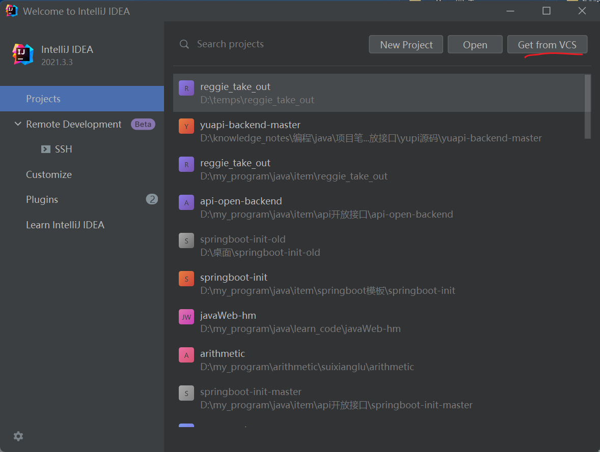
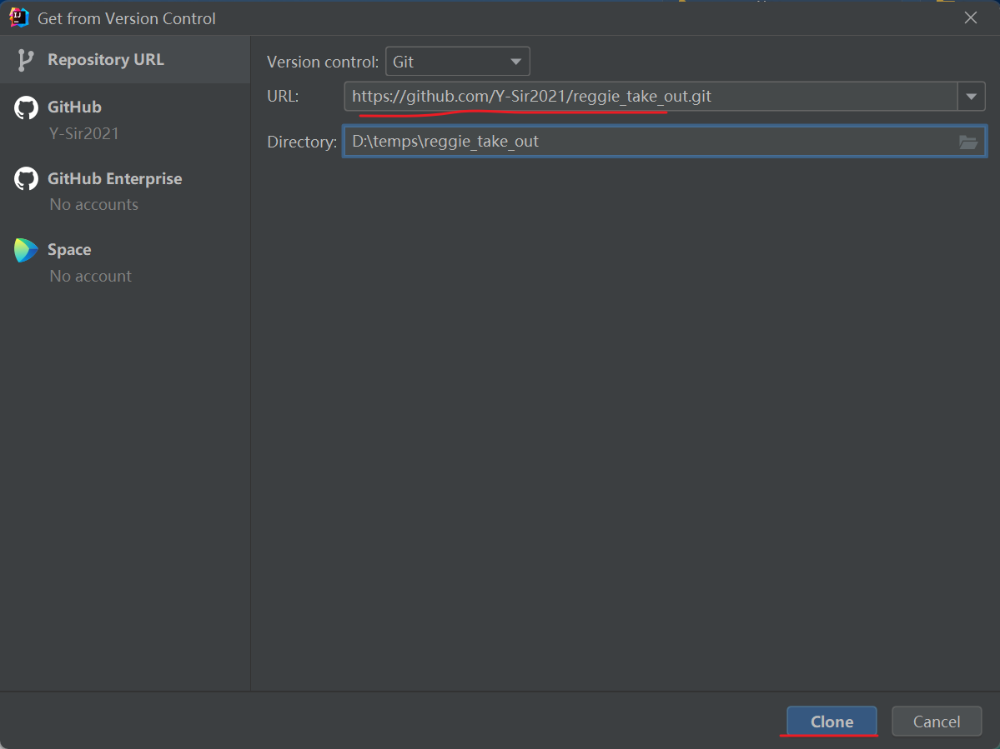
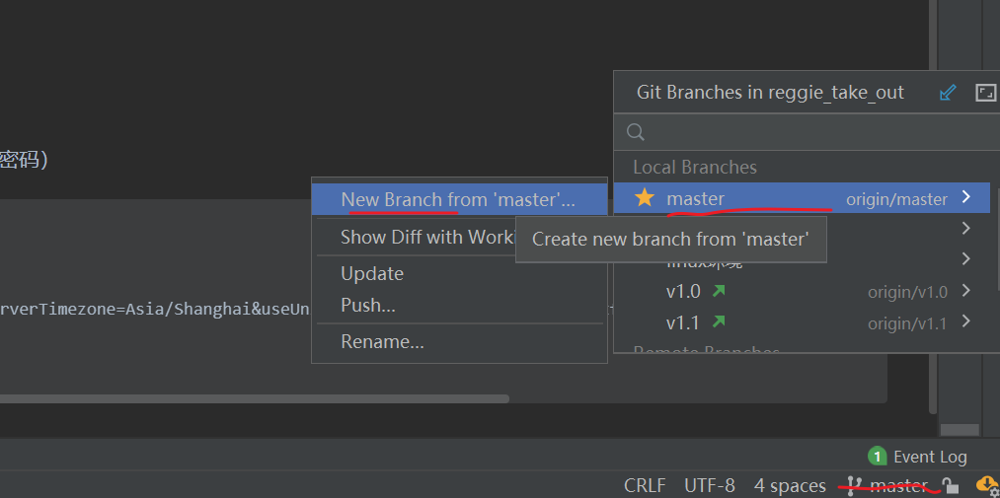

# reggie
##拉取代码到本地
- 代码地址：https://github.com/Y-Sir2021/reggie_take_out.git
- 
  
  
- 创建自己的分支
  


## 快读运行
- 在mysql中执行sql/reggie.sql脚本
- 修改datasource各参数为自己的（端口，用户名，密码）
```yaml
  datasource:
    druid:
      driver-class-name: com.mysql.cj.jdbc.Driver
      url: jdbc:mysql://localhost:13306/reggie?serverTimezone=Asia/Shanghai&useUnicode=true&characterEncoding=utf-8&zeroDateTimeBehavior=convertToNull&useSSL=false&allowPublicKeyRetrieval=true
      username: root
      password: abc123
```
- 运行ReggieApplication的main方法
我加的